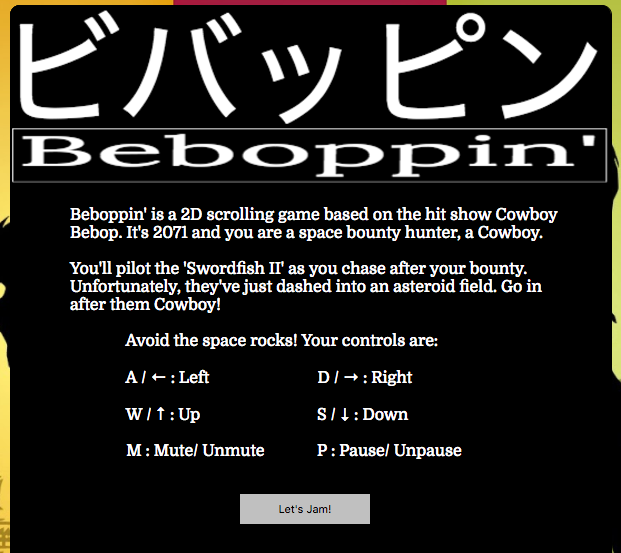
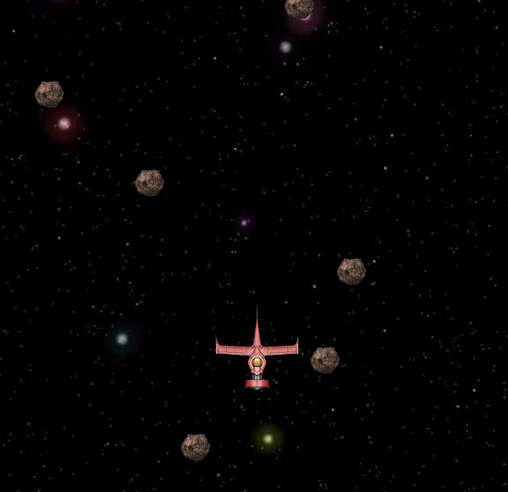
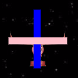
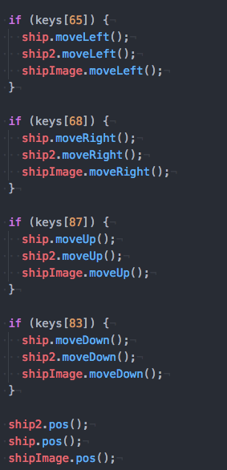

Beboppin'
-------------------
Beboppin' is a 2D vertical scroller based on the tv show "Cowboy Bebop".

Players take the role of a 'Space Cowboy', a space bounty hunter in the
year 2071. Travel between the planets is common, and so is crime. It's
up to the 'cowboys' to catch those on the run.

The player pilots their ship, Swordfish II, and must fly through an
asteroid field, to capture their bounty.

This project was created using HTML Canvas, JavaScript, and jQuery.

Features and Implementation
-----------------------

Upon loading the page, the player is show a splash page, telling them
about the setting, and the basic controls.

Once the user understands the basic controls and click on "Let's Jam",
the splash screen disappears. This is accomplished using an addEventListener, which waits for the player's click.

The function that handles the click uses jQuery to hide the splash
screen element, and fires another event, using jQuery again, that
animates a small element emerging from behind the canvas, displaying
the controls of the game. I decided to do this, in case the player
forgets the controls while playing.

Now we get to the main game!

The player can move their ship along using WASD keys, or the arrows keys, all of which are linked to 'keydown' and 'keyup' even listeners.
This allows the player to hold down a key/keys continuously.

The Ship

For the moment, we will focus on the ship. What the player can see is
a single image. Behind the scenes, the player is controlling not one,
but THREE objects at once.

Why was this done? The ship is an unusual shape, and not one that Canvas has an easy time of duplicating. (It is easiest to generate rectangles or circles). I didn't want a hit collision to register just because an asteroid hit one of the corners!

The three elements are created at the same time, and placed on the canvas in the appropriate
location. When the player taps a key, all three pieces move together as one!

